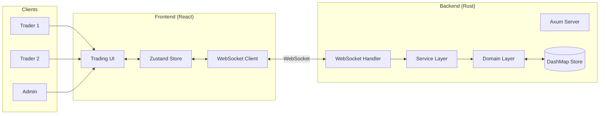
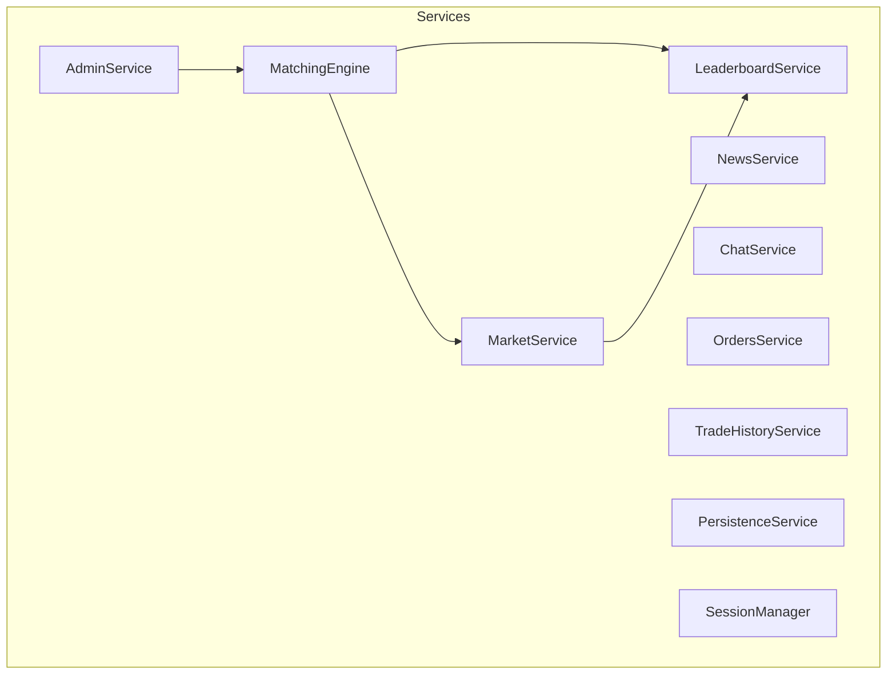
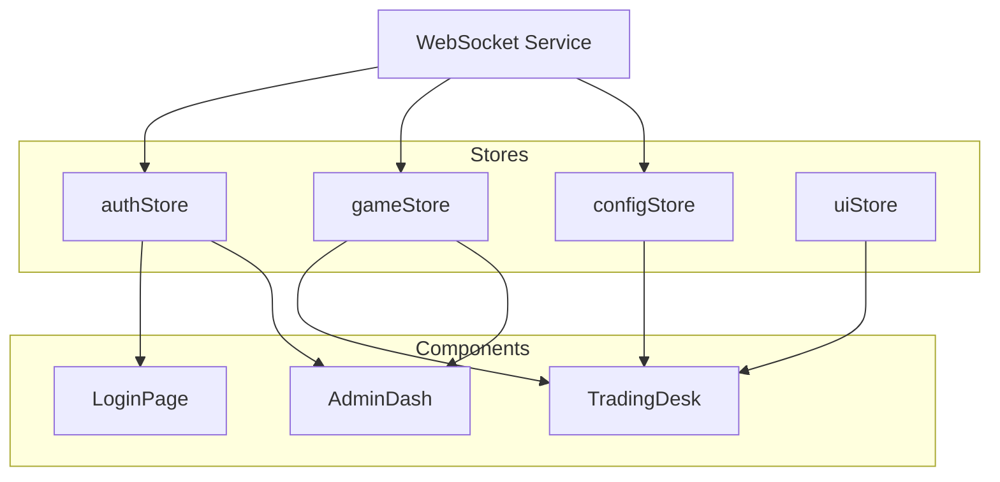
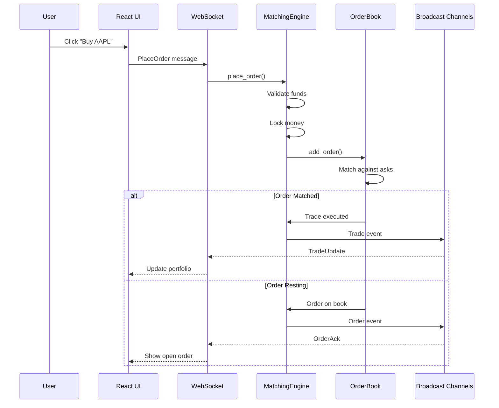
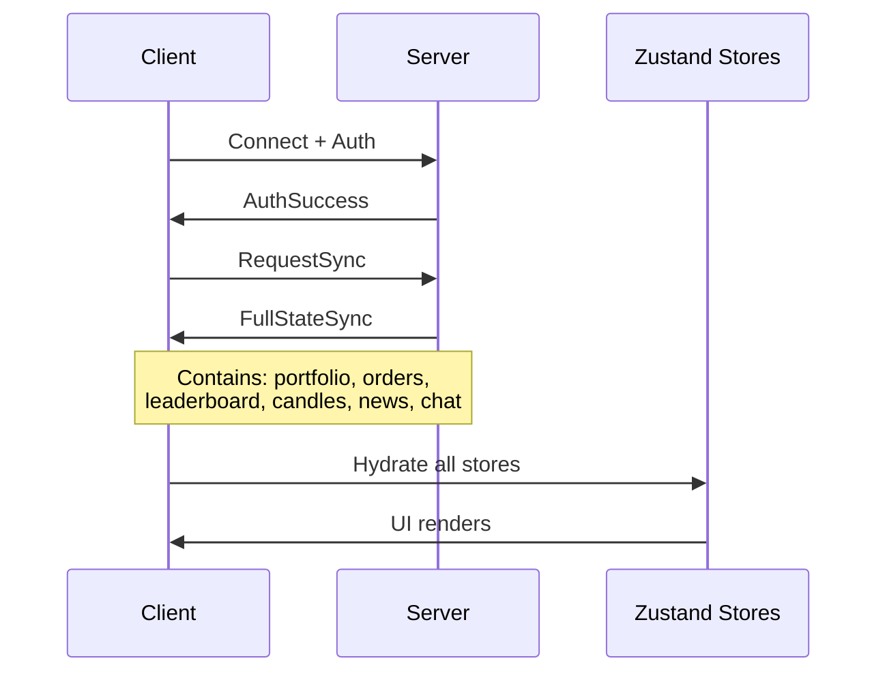

# StockMart Architecture

This document provides a detailed technical overview of StockMart's architecture, design decisions, and implementation details.

## Table of Contents

- [System Overview](#system-overview)
- [Backend Architecture](#backend-architecture)
  - [Domain Layer](#domain-layer)
  - [Service Layer](#service-layer)
  - [Infrastructure Layer](#infrastructure-layer)
  - [Presentation Layer](#presentation-layer)
- [Frontend Architecture](#frontend-architecture)
  - [State Management](#state-management)
  - [Component Structure](#component-structure)
  - [WebSocket Integration](#websocket-integration)
- [Data Flow](#data-flow)
- [Matching Engine](#matching-engine)
- [Real-time Communication](#real-time-communication)
- [Security Model](#security-model)
- [Scalability Considerations](#scalability-considerations)

---

## System Overview

StockMart is a full-stack trading simulation platform with a Rust backend and React frontend, connected via WebSocket for real-time communication.



### Key Characteristics

| Aspect | Implementation |
|--------|----------------|
| **Architecture Style** | Domain-Driven Design (DDD) |
| **Communication** | WebSocket (real-time) |
| **Data Storage** | In-memory with JSON persistence |
| **Concurrency Model** | Async/await with Tokio |
| **Frontend State** | Zustand with WebSocket sync |

---

## Backend Architecture

The backend follows a layered architecture with Domain-Driven Design principles:

```
┌─────────────────────────────────────────────────────────┐
│                  Presentation Layer                      │
│              (WebSocket Handlers, Messages)              │
├─────────────────────────────────────────────────────────┤
│                    Service Layer                         │
│    (MatchingEngine, MarketService, LeaderboardService)   │
├─────────────────────────────────────────────────────────┤
│                    Domain Layer                          │
│        (Entities, Value Objects, Domain Events)          │
├─────────────────────────────────────────────────────────┤
│                 Infrastructure Layer                     │
│         (Repositories, Persistence, ID Generation)       │
└─────────────────────────────────────────────────────────┘
```

### Domain Layer

The domain layer contains the core business logic, organized into **bounded contexts**:

#### User Context (`domain/user/`)

```rust
// User Entity
pub struct User {
    pub id: UserId,
    pub regno: String,           // Registration number (login)
    pub name: String,
    pub password_hash: String,
    pub role: Role,              // Trader or Admin
    pub money: i64,              // Available cash (scaled)
    pub locked_money: i64,       // Locked in pending orders
    pub margin_locked: i64,      // Locked for short positions
    pub chat_enabled: bool,
    pub banned: bool,
    pub portfolio: Vec<PortfolioItem>,
}

// Portfolio Item
pub struct PortfolioItem {
    pub symbol: String,
    pub qty: u64,                // Long position
    pub short_qty: u64,          // Short position
    pub locked_qty: u64,         // Locked in pending sells
    pub average_buy_price: i64,
}

// Role-based access control
pub enum Role {
    Trader,
    Admin,
}
```

#### Trading Context (`domain/trading/`)

```rust
// Order Entity
pub struct Order {
    pub id: OrderId,
    pub user_id: UserId,
    pub symbol: String,
    pub order_type: OrderType,
    pub side: OrderSide,
    pub price: Price,
    pub quantity: Quantity,
    pub filled_quantity: Quantity,
    pub status: OrderStatus,
    pub time_in_force: TimeInForce,
    pub created_at: Timestamp,
}

pub enum OrderType { Market, Limit }
pub enum OrderSide { Buy, Sell, Short }
pub enum OrderStatus { Open, Partial, Filled, Cancelled, Rejected }
pub enum TimeInForce { GTC, IOC }  // Good Till Cancelled, Immediate or Cancel

// Trade Entity (executed order)
pub struct Trade {
    pub id: TradeId,
    pub maker_order_id: OrderId,
    pub taker_order_id: OrderId,
    pub maker_user_id: UserId,
    pub taker_user_id: UserId,
    pub symbol: String,
    pub price: Price,
    pub quantity: Quantity,
    pub timestamp: Timestamp,
}
```

#### Market Context (`domain/market/`)

```rust
// Company Entity
pub struct Company {
    pub id: CompanyId,
    pub symbol: String,
    pub name: String,
    pub sector: String,
    pub total_shares: u64,
    pub is_bankrupt: bool,
    pub price_precision: u8,
    pub volatility: f64,
}

// Candle (OHLCV data)
pub struct Candle {
    pub symbol: String,
    pub open: Price,
    pub high: Price,
    pub low: Price,
    pub close: Price,
    pub volume: u64,
    pub timestamp: Timestamp,
}
```

#### Constants (`domain/constants.rs`)

All magic numbers are centralized:

```rust
// Price scaling (avoid floating point)
pub const PRICE_SCALE: i64 = 10_000;  // $100.50 = 1_005_000

// Trading
pub const SHORT_MARGIN_PERCENT: u64 = 150;
pub const TRADE_CHANNEL_SIZE: usize = 1000;

// Circuit Breaker
pub const CIRCUIT_BREAKER_THRESHOLD_PERCENT: f64 = 10.0;
pub const CIRCUIT_BREAKER_HALT_DURATION_SECS: u64 = 60;

// Defaults
pub const DEFAULT_STARTING_MONEY: i64 = 100_000 * PRICE_SCALE;
pub const DEFAULT_SHARES_PER_COMPANY: u64 = 100;
```

### Service Layer

Services orchestrate business operations and manage cross-cutting concerns:



#### MatchingEngine (`service/engine.rs`)

The core trading engine with price-time priority matching:

```rust
impl MatchingEngine {
    /// Place a new order
    pub async fn place_order(&self, order: OrderRequest) -> Result<Order, TradingError> {
        // 1. Validate funds/shares
        // 2. Lock resources
        // 3. Add to orderbook
        // 4. Match against opposite side
        // 5. Execute trades
        // 6. Broadcast updates
    }

    /// Cancel an existing order
    pub async fn cancel_order(&self, order_id: OrderId, user_id: UserId) -> Result<(), TradingError>;

    /// Control market state
    pub fn set_market_open(&self, open: bool);
    pub fn is_market_open(&self) -> bool;
}
```

#### MarketService (`service/market.rs`)

Manages candle aggregation and circuit breakers:

```rust
impl MarketService {
    /// Process a trade and update candles
    pub async fn process_trade(&self, trade: &Trade);

    /// Check and trigger circuit breakers
    pub fn check_circuit_breaker(&self, symbol: &str, price: Price) -> bool;

    /// Get current candles for a symbol
    pub fn get_candles(&self, symbol: &str) -> Vec<Candle>;
}
```

#### LeaderboardService (`service/leaderboard.rs`)

Calculates and broadcasts rankings every 5 seconds:

```rust
impl LeaderboardService {
    /// Calculate net worth for a user
    fn calculate_net_worth(&self, user: &User) -> i64 {
        user.money
            + user.locked_money
            + user.margin_locked
            + self.calculate_portfolio_value(&user.portfolio)
    }

    /// Recalculate and broadcast leaderboard
    pub async fn update_leaderboard(&self);
}
```

### Infrastructure Layer

#### Repository Pattern (`infrastructure/persistence/`)

Trait-based repositories for easy swapping:

```rust
pub trait UserRepository: Send + Sync {
    fn find_by_id(&self, id: UserId) -> Option<User>;
    fn find_by_regno(&self, regno: &str) -> Option<User>;
    fn save(&self, user: User) -> Result<(), RepositoryError>;
    fn delete(&self, id: UserId) -> Result<(), RepositoryError>;
    fn all(&self) -> Vec<User>;
}

pub trait CompanyRepository: Send + Sync {
    fn find_by_symbol(&self, symbol: &str) -> Option<Company>;
    fn all_tradable(&self) -> Vec<Company>;  // Non-bankrupt only
    // ...
}
```

#### In-Memory Implementation (`infrastructure/persistence/memory.rs`)

Uses DashMap for lock-free concurrent access:

```rust
pub struct InMemoryUserRepository {
    users: DashMap<UserId, User>,
    regno_index: DashMap<String, UserId>,
}
```

#### ID Generation (`infrastructure/id_generator.rs`)

Atomic counters for distributed ID generation:

```rust
static USER_ID_COUNTER: AtomicU64 = AtomicU64::new(1);
static ORDER_ID_COUNTER: AtomicU64 = AtomicU64::new(1);
static TRADE_ID_COUNTER: AtomicU64 = AtomicU64::new(1);
```

### Presentation Layer

#### WebSocket Messages (`presentation/websocket/messages/`)

50+ typed message types for client-server communication:

```rust
// Client -> Server
pub enum ClientMessage {
    // Auth
    Login { regno: String, password: String },
    Register { regno: String, name: String, password: String },

    // Trading
    PlaceOrder { symbol: String, side: OrderSide, ... },
    CancelOrder { order_id: OrderId },

    // Market Data
    Subscribe { symbol: String },
    GetDepth { symbol: String },

    // Admin
    AdminAction(AdminAction),
}

// Server -> Client
pub enum ServerMessage {
    // Auth
    AuthSuccess { user: User, token: String },
    AuthFailed { error: String },

    // Trading
    OrderAck { order: Order },
    OrderRejected { reason: String },
    TradeUpdate { trade: Trade },

    // Market Data
    CandleUpdate { candle: Candle },
    DepthUpdate { bids: Vec<Level>, asks: Vec<Level> },

    // Sync
    FullStateSync { ... },
}
```

---

## Frontend Architecture

### State Management

The frontend uses Zustand with four primary stores:



#### authStore

```typescript
interface AuthState {
    user: User | null;
    isAuthenticated: boolean;
    isLoading: boolean;
    error: string | null;

    login: (regno: string, password: string) => Promise<void>;
    register: (regno: string, name: string, password: string) => Promise<void>;
    logout: () => void;
}
```

#### gameStore

```typescript
interface GameState {
    // Market Data
    companies: Company[];
    activeSymbol: string;
    candles: Map<string, Candle[]>;
    orderbook: { bids: Level[], asks: Level[] };

    // Portfolio
    portfolio: PortfolioItem[];
    openOrders: Order[];
    tradeHistory: Trade[];

    // Social
    leaderboard: LeaderboardEntry[];
    chatMessages: ChatMessage[];
    news: NewsItem[];

    // Actions
    placeOrder: (order: OrderRequest) => void;
    cancelOrder: (orderId: string) => void;
    setActiveSymbol: (symbol: string) => void;
}
```

### Component Structure

```
frontend/src/
├── features/
│   ├── auth/
│   │   ├── LoginPage.tsx
│   │   ├── RegisterPage.tsx
│   │   └── AuthGuard.tsx
│   ├── trader/
│   │   ├── TradingDeskPage.tsx
│   │   └── components/
│   │       ├── QuickTradeWidget.tsx
│   │       ├── OrderBookWidget.tsx
│   │       ├── PortfolioWidget.tsx
│   │       ├── LeaderboardWidget.tsx
│   │       ├── ChatWidget.tsx
│   │       ├── NewsTicker.tsx
│   │       └── MarketIndicesBar.tsx
│   └── admin/
│       ├── DashboardPage.tsx
│       ├── GameControlPage.tsx
│       └── TradersPage.tsx
├── components/
│   ├── charts/
│   │   └── Chart.tsx        # Lightweight Charts
│   ├── common/
│   │   ├── Button.tsx
│   │   ├── Modal.tsx
│   │   └── Toast.tsx
│   └── layout/
│       └── Header.tsx
└── services/
    └── websocket.ts          # WebSocket client
```

### WebSocket Integration

The WebSocket service provides auto-reconnect and message queuing:

```typescript
class WebSocketService {
    private ws: WebSocket | null = null;
    private messageQueue: Message[] = [];
    private reconnectAttempts = 0;
    private maxReconnectDelay = 30000;

    connect(): void {
        this.ws = new WebSocket('ws://localhost:3000/ws');

        this.ws.onmessage = (event) => {
            const message = JSON.parse(event.data);
            this.dispatch(message);
        };

        this.ws.onclose = () => {
            this.scheduleReconnect();
        };
    }

    send(message: ClientMessage): void {
        if (this.ws?.readyState === WebSocket.OPEN) {
            this.ws.send(JSON.stringify(message));
        } else {
            this.messageQueue.push({ message, timestamp: Date.now() });
        }
    }

    private dispatch(message: ServerMessage): void {
        // Route to appropriate store based on message type
        switch (message.type) {
            case 'AuthSuccess':
                useAuthStore.getState().setUser(message.user);
                break;
            case 'CandleUpdate':
                useGameStore.getState().addCandle(message.candle);
                break;
            // ... 50+ message types
        }
    }
}
```

---

## Data Flow

### Order Placement Flow



### State Synchronization

On connect/reconnect, clients receive a full state sync:



---

## Matching Engine

### OrderBook Implementation

The orderbook uses BTreeMap for price-sorted orders with FIFO at each price level:

```rust
pub struct OrderBook {
    // Bids: descending price order (highest first)
    bids: BTreeMap<Reverse<Price>, VecDeque<Order>>,

    // Asks: ascending price order (lowest first)
    asks: BTreeMap<Price, VecDeque<Order>>,

    // Fast lookup by order ID
    order_index: HashMap<OrderId, (Price, OrderSide)>,
}

impl OrderBook {
    pub fn match_order(&mut self, order: &mut Order) -> Vec<Trade> {
        let trades = Vec::new();

        match order.side {
            OrderSide::Buy => {
                // Match against asks (lowest first)
                while order.remaining() > 0 {
                    if let Some(best_ask) = self.asks.first_entry() {
                        if order.price >= *best_ask.key() {
                            // Execute trade at ask price
                            trades.push(self.execute_trade(order, best_ask));
                        } else {
                            break;  // Price doesn't cross
                        }
                    } else {
                        break;  // No more asks
                    }
                }
            }
            OrderSide::Sell | OrderSide::Short => {
                // Match against bids (highest first)
                // Similar logic
            }
        }

        trades
    }
}
```

### Price-Time Priority

1. **Price Priority**: Better prices execute first
   - Buys: Higher price has priority
   - Sells: Lower price has priority

2. **Time Priority**: At same price, first order wins
   - VecDeque maintains FIFO order

### Market vs Limit Orders

| Order Type | Behavior |
|------------|----------|
| **Market** | Uses extreme price (MAX for buy, 1 for sell), guarantees fill |
| **Limit** | Only fills at specified price or better |

### Time-in-Force

| TIF | Behavior |
|-----|----------|
| **GTC** | Good Till Cancelled - stays on book until filled or cancelled |
| **IOC** | Immediate or Cancel - fills what it can, cancels rest |

---

## Real-time Communication

### Broadcast Channels

Tokio broadcast channels distribute updates to all connected clients:

```rust
pub struct BroadcastChannels {
    pub trades: broadcast::Sender<Trade>,
    pub candles: broadcast::Sender<Candle>,
    pub leaderboard: broadcast::Sender<Vec<LeaderboardEntry>>,
    pub news: broadcast::Sender<NewsItem>,
    pub chat: broadcast::Sender<ChatMessage>,
    pub circuit_breaker: broadcast::Sender<CircuitBreakerEvent>,
    pub indices: broadcast::Sender<Vec<MarketIndex>>,
}
```

### Connection Handling

Each WebSocket connection spawns a task that:
1. Receives client messages
2. Subscribes to broadcast channels
3. Handles both directions with `tokio::select!`

```rust
async fn handle_connection(ws: WebSocket, state: AppState) {
    let (mut sender, mut receiver) = ws.split();

    let mut trades_rx = state.broadcasts.trades.subscribe();
    let mut candles_rx = state.broadcasts.candles.subscribe();
    // ... more subscriptions

    loop {
        tokio::select! {
            Some(msg) = receiver.next() => {
                // Handle client message
                handle_client_message(msg, &state).await;
            }
            Ok(trade) = trades_rx.recv() => {
                // Forward trade to client
                sender.send(ServerMessage::TradeUpdate(trade)).await;
            }
            Ok(candle) = candles_rx.recv() => {
                sender.send(ServerMessage::CandleUpdate(candle)).await;
            }
            // ... more channels
        }
    }
}
```

---

## Security Model

### Authentication

1. **Registration**: Username + password stored (hashed in production)
2. **Login**: Validates credentials, returns session token
3. **Session**: Token required for authenticated actions
4. **Role Check**: Admin actions verified against `Role::Admin`

### Authorization

```rust
// Role-based access control
fn check_admin(user: &User) -> Result<(), UserError> {
    match user.role {
        Role::Admin => Ok(()),
        Role::Trader => Err(UserError::PermissionDenied),
    }
}
```

### Input Validation

All inputs validated at domain layer:

```rust
// Order validation
fn validate_order(order: &OrderRequest, user: &User) -> Result<(), TradingError> {
    // Check market is open
    if !self.is_market_open() {
        return Err(TradingError::MarketClosed);
    }

    // Check sufficient funds/shares
    match order.side {
        OrderSide::Buy => {
            let required = order.price * order.quantity;
            if user.money < required {
                return Err(TradingError::InsufficientFunds { required, available: user.money });
            }
        }
        OrderSide::Sell => {
            if user.get_available_shares(&order.symbol) < order.quantity {
                return Err(TradingError::InsufficientShares);
            }
        }
        OrderSide::Short => {
            let margin = (order.price * order.quantity * SHORT_MARGIN_PERCENT) / 100;
            if user.money < margin {
                return Err(TradingError::InsufficientMargin);
            }
        }
    }

    Ok(())
}
```

---

## Scalability Considerations

### Current Limitations

| Aspect | Current | Limit | Solution |
|--------|---------|-------|----------|
| **Users** | In-memory | ~10,000 | PostgreSQL |
| **Concurrency** | Single process | CPU cores | Sharding by symbol |
| **Persistence** | JSON file | I/O bound | Database + WAL |
| **WebSocket** | Single server | ~10,000 connections | Load balancer |

### Scaling Strategies

1. **Horizontal Scaling**
   - Shard orderbooks by symbol
   - Separate read replicas for market data

2. **Database Migration**
   - Repository pattern makes swap easy
   - Add PostgreSQL implementation

3. **Message Queue**
   - Add Redis/Kafka for cross-process events
   - Decouple matching from broadcasting

4. **Caching**
   - Cache leaderboard calculations
   - Cache orderbook depth snapshots

### Production Checklist

- [ ] Replace JSON persistence with PostgreSQL
- [ ] Add proper password hashing (argon2/bcrypt)
- [ ] Enable TLS for WebSocket connections
- [ ] Configure CORS for production domain
- [ ] Add rate limiting
- [ ] Set up monitoring (Prometheus/Grafana)
- [ ] Add structured logging (JSON format)
- [ ] Implement health check endpoints

---

## Further Reading

- [Rust Async Book](https://rust-lang.github.io/async-book/)
- [Tokio Tutorial](https://tokio.rs/tokio/tutorial)
- [Domain-Driven Design](https://martinfowler.com/bliki/DomainDrivenDesign.html)
- [Trading System Design](https://www.investopedia.com/terms/m/matchingorders.asp)
